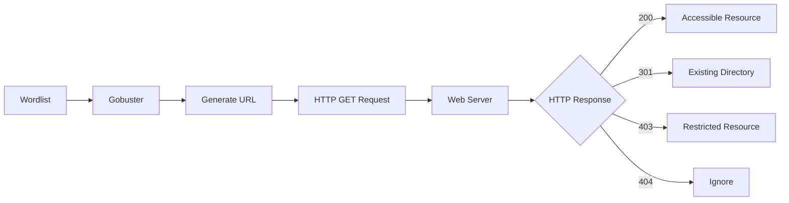
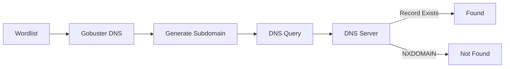
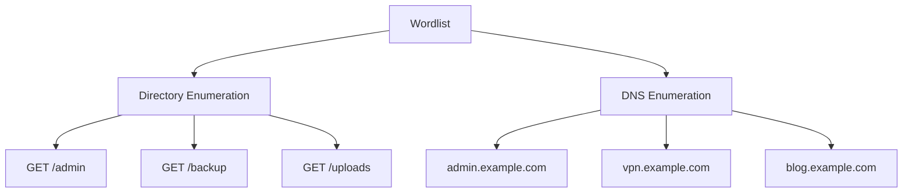
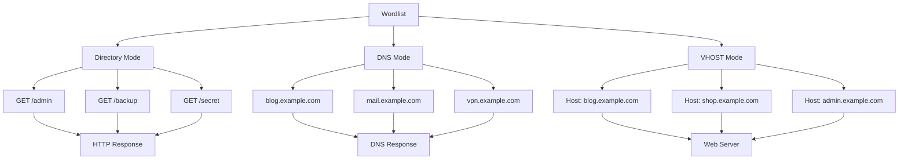

# TryHackMe — Gobuster: The Basics

> Learn how to perform directory, DNS, and virtual host enumeration using Gobuster while understanding the concepts behind each technique instead of simply memorizing commands.

---

# Overview

Enumeration is one of the most important phases during a penetration test. Before exploiting a target, an attacker must first understand what services, directories, subdomains, and hidden resources are available.

This room introduces **Gobuster**, one of the most widely used reconnaissance tools in penetration testing. Rather than searching for vulnerabilities directly, Gobuster focuses on discovering hidden resources that developers may have unintentionally exposed.

Unlike many walkthroughs that simply list commands, this write-up explains **why each command is used**, **how Gobuster works internally**, and **how to interpret the results** to make informed decisions during an assessment.

Throughout this room we will explore three major Gobuster modes:

- Directory Enumeration
- DNS Enumeration
- Virtual Host Enumeration

Each section includes explanations of the command syntax, output analysis, common mistakes, and defensive recommendations.

> **Disclaimer**
>
> All activities demonstrated in this article were performed inside the TryHackMe training environment. The techniques described here should only be used against systems you own or have explicit permission to assess.

---

# Background Concept

## What is Enumeration?

Enumeration is the process of gathering as much information as possible about a target before attempting exploitation.

Think of enumeration as surveying a building before trying to enter it.

Instead of randomly looking for a way inside, you first identify:

- every entrance
- emergency exits
- windows
- hidden doors
- security cameras

The more information collected during reconnaissance, the easier it becomes to identify potential attack paths.

Within web applications, enumeration commonly focuses on discovering:

- Hidden directories
- Administrative panels
- Backup files
- API endpoints
- Source code repositories
- Configuration files

Missing just one hidden directory could mean overlooking the vulnerability that ultimately leads to full compromise.

---

## What is Brute Force?

Brute forcing is often associated with password attacks, but the concept is much broader.

A brute-force attack simply means trying every possible option until a valid result is found.

Gobuster applies this concept to web resources.

For example, given the following wordlist:

```
admin
login
backup
secret
images
```

Gobuster automatically generates requests like:

```
GET /admin
GET /login
GET /backup
GET /secret
GET /images
```

Each request is then evaluated based on the HTTP response received from the server.

If the server returns:

```
HTTP/1.1 200 OK
```

the requested resource most likely exists.

If the response is:

```
HTTP/1.1 404 Not Found
```

Gobuster moves on to the next entry in the wordlist.

This simple yet powerful technique allows security professionals to quickly identify hidden content that may not be linked anywhere on the website.

---

## Why Gobuster?

Gobuster is an open-source enumeration tool written in **Go (Golang)**.

Because it is compiled, lightweight, and highly concurrent, Gobuster can send multiple requests simultaneously, making it significantly faster than manually checking resources one by one.

Its primary use cases include:

- Directory enumeration
- File discovery
- DNS subdomain enumeration
- Virtual host discovery
- Amazon S3 bucket enumeration
- Google Cloud Storage enumeration
- Fuzzing endpoints

Gobuster is included by default in many penetration testing distributions such as **Kali Linux**.

---

# Lab Information

| Item | Information |
|------|-------------|
| Platform | TryHackMe |
| Room | Gobuster: The Basics |
| Difficulty | Easy |
| Category | Web Enumeration |
| Tool | Gobuster |
| Wordlists | Dirbuster, SecLists |
| Attack Phase | Reconnaissance |

---

# Learning Objectives

By the end of this room you should understand:

- How Gobuster performs brute-force enumeration
- How to enumerate hidden directories
- How to discover hidden files
- How DNS enumeration works
- The difference between DNS and Virtual Hosts
- How to interpret HTTP response codes
- How to customize Gobuster using commonly used flags

---

# Phase 1 — Exploring Gobuster

Before using any security tool, understanding its capabilities is just as important as knowing its syntax.

Gobuster provides several operating modes, each designed for a different type of reconnaissance.

Running the help menu reveals every available module.

```bash
gobuster --help
```

Output:

```text
Available Commands:

completion
dir
dns
fuzz
gcs
help
s3
tftp
version
vhost
```

Instead of memorizing every option, let's understand what each mode actually does.

| Mode | Purpose |
|------|----------|
| dir | Directory and file enumeration |
| dns | DNS subdomain enumeration |
| vhost | Virtual host enumeration |
| fuzz | General fuzzing mode |
| s3 | AWS S3 bucket discovery |
| gcs | Google Cloud Storage discovery |
| tftp | TFTP enumeration |

For this room, the primary focus is on the three modes most commonly encountered during web application assessments:

- `dir`
- `dns`
- `vhost`

---

## Understanding Common Flags

Most Gobuster commands rely on a small set of reusable options.

| Flag | Description |
|------|-------------|
| `-u` | Specifies the target URL |
| `-w` | Specifies the wordlist |
| `-t` | Number of concurrent threads |
| `-o` | Save output to a file |
| `--delay` | Delay between requests |
| `--debug` | Display debugging information |

For example:

```bash
gobuster dir \
-u http://example.thm \
-w /usr/share/wordlists/dirb/small.txt \
-t 64
```

Let's break this command down.

### `dir`

Tells Gobuster to use **directory enumeration mode**.

Instead of scanning ports or DNS records, Gobuster will attempt to discover hidden folders and files beneath the supplied URL.

---

### `-u`

Defines the target website.

```
http://example.thm
```

Notice that the protocol (`http://`) is mandatory.

Without specifying the protocol, Gobuster cannot determine how to establish the connection.

---

### `-w`

Specifies the wordlist.

A wordlist acts as the dictionary Gobuster uses during brute-force enumeration.

Every word becomes a possible resource.

For example:

```
admin
backup
images
secret
```

generates requests like:

```
GET /admin
GET /backup
GET /images
GET /secret
```

---

### `-t`

Defines how many worker threads Gobuster should use.

Increasing the number of threads allows multiple requests to be sent simultaneously, greatly improving scan speed.

However, excessive threading can:

- overload slower servers
- trigger rate-limiting
- activate Web Application Firewalls (WAFs)

Choosing the appropriate thread count depends on the assessment environment.

---

## Room Questions

### Question

**What flag specifies the target URL?**

Answer:

```
-u
```

Verification:

```bash
gobuster dir --help | grep target
```

Output:

```text
--url value, -u value    The target URL
```

---

### Question

**Which command performs subdomain enumeration?**

Answer:

```
dns
```

Verification:

```bash
gobuster --help | grep dns
```

Output:

```text
dns      Uses DNS subdomain enumeration mode
```

---

## Phase Summary

At this stage, we have not attacked the target yet.

Instead, we learned how Gobuster is structured, explored its available modules, and understood the most commonly used flags.

Understanding these fundamentals will make the following reconnaissance phases much easier, as we will already know exactly **why** each command is being executed instead of blindly copying commands from a walkthrough.

---

# Phase 2 — Directory Enumeration

Once we understand how Gobuster works, the next step is applying it against a real target.

The objective of this phase is simple:

- Discover hidden directories
- Identify sensitive files
- Reveal resources that are not linked from the main website

Hidden resources are extremely common in real-world environments. Developers often leave behind backup files, administrative portals, testing pages, or unfinished features that are never intended to be publicly accessible.

Directory enumeration helps uncover these resources before moving on to vulnerability assessment.

---

# Understanding Directory Enumeration

When a user visits a website, they usually navigate using hyperlinks exposed by the application.

For example:

```
Home
About
Contact
Login
```

However, these visible links represent only a small portion of the application's structure.

There may also be directories such as:

```
/backup
/admin
/uploads
/private
/dev
/api
```

that are never referenced anywhere on the website.

Gobuster automates the discovery process by taking each word from a wordlist and requesting it from the target server.

For example, if the wordlist contains:

```
admin
images
secret
uploads
```

Gobuster generates HTTP requests similar to:

```
GET /admin
GET /images
GET /secret
GET /uploads
```

The web server then responds with an HTTP status code, allowing us to determine whether the resource exists.

---

# Important HTTP Status Codes

Understanding HTTP responses is just as important as running the scan itself.

| Status Code | Meaning |
|-------------|---------|
| 200 OK | Resource exists and is accessible |
| 301 Moved Permanently | Resource exists and redirects elsewhere |
| 302 Found | Temporary redirect |
| 401 Unauthorized | Authentication required |
| 403 Forbidden | Resource exists but access is denied |
| 404 Not Found | Resource does not exist |

A common mistake among beginners is ignoring anything other than **200 OK**.

In reality, **301** and **403** are often just as valuable because they confirm that the requested resource exists.

---

# Configuring Local Name Resolution

Before scanning the target, the room requires us to resolve the hostname manually.

Unlike public websites, many CTF and laboratory environments do not have publicly available DNS records.

Instead, we manually map the hostname to its IP address by editing the local hosts file.

First, inspect the current configuration.

```bash
sudo cat /etc/hosts
```

The file initially contains only the default localhost entries.

```text
127.0.0.1 localhost
127.0.1.1 LAPTOP.localdomain
...
```

Next, append the target machine.

```text
10.48.173.0    www.offensivetools.thm
```

Save the file and verify that hostname resolution now works correctly.

```bash
ping www.offensivetools.thm
```

Example output:

```text
PING www.offensivetools.thm (10.48.173.0)

64 bytes from www.offensivetools.thm

64 bytes from www.offensivetools.thm
```

Receiving successful replies confirms that the operating system now resolves the hostname correctly.

Without this step, Gobuster would fail because it would not know which IP address belongs to **www.offensivetools.thm**.

---

# Running the First Directory Scan

With hostname resolution working, we can finally perform directory enumeration.

```bash
gobuster dir \
-u http://www.offensivetools.thm \
-w /usr/share/wordlists/dirbuster/directory-list-2.3-medium.txt
```

Let's examine every part of this command.

| Option | Purpose |
|---------|----------|
| dir | Enable directory enumeration mode |
| -u | Target website |
| -w | Wordlist used during brute force |

Gobuster begins sending thousands of HTTP requests generated from the supplied wordlist.

Eventually, several interesting directories appear.

```text
images           (Status: 301)
home             (Status: 200)
media            (Status: 301)
templates        (Status: 301)
modules          (Status: 301)
plugins          (Status: 301)
includes         (Status: 301)
language         (Status: 301)
components       (Status: 301)
api              (Status: 301)
cache            (Status: 301)
libraries        (Status: 403)
tmp              (Status: 301)
layouts          (Status: 301)
secret           (Status: 301)
administrator    (Status: 301)
```

---

# Analyzing the Results

Instead of celebrating every discovered directory, let's understand what each response actually means.

### images (301)

```
images (Status:301)
```

The server redirects requests to `/images/`.

This confirms that the directory exists.

Image directories usually contain static content and are rarely sensitive, although they may occasionally reveal backup files or hidden uploads.

---

### home (200)

```
home (Status:200)
```

Unlike the previous result, this page is directly accessible.

A **200 OK** response indicates that the resource is publicly available.

This directory deserves further manual inspection using a browser.

---

### libraries (403)

```
libraries (Status:403)
```

Many beginners ignore **403 Forbidden** responses.

That is a mistake.

A **403** response means:

> The resource exists, but the server refuses access.

Knowing that a directory exists can become extremely valuable later if another vulnerability allows bypassing access restrictions.

---

### administrator (301)

Administrative portals are among the most attractive findings during reconnaissance.

Although simply discovering an administrator panel does not immediately indicate a vulnerability, it reveals an additional attack surface that may later be targeted using authentication attacks or known exploits.

---

### secret (301)

This directory immediately stands out.

Unlike standard CMS folders such as:

```
images
templates
modules
```

the name **secret** suggests intentionally hidden content.

Although naming alone does not prove anything, unusual directory names often deserve additional investigation.

This becomes our next target.

---

# Why "secret" Deserves Further Enumeration

Gobuster performs **non-recursive** scanning.

This means that discovering:

```
/secret/
```

does **not** automatically enumerate:

```
/secret/uploads/
/secret/scripts/
/secret/content/
```

Each newly discovered directory must be scanned individually.

Ignoring this behavior is one of the most common mistakes made by beginners.

---

# Enumerating the Secret Directory

Now we launch a second scan against the newly discovered directory.

Additionally, we use the **-x** flag to search for JavaScript files.

```bash
gobuster dir \
-u http://www.offensivetools.thm/secret \
-w /usr/share/wordlists/dirbuster/directory-list-2.3-medium.txt \
-x .js
```

The **-x** option instructs Gobuster to append specific file extensions during enumeration.

Instead of requesting only:

```
/flag
```

Gobuster also requests:

```
/flag.js
/admin.js
/login.js
/config.js
```

This dramatically increases the chances of finding exposed source files.

---

# Enumeration Results

The second scan reveals several additional resources.

```text
content        (Status:301)

uploads        (Status:301)

scripts        (Status:301)

flag.js        (Status:200)
```

Most interestingly, Gobuster discovers:

```
flag.js
```

Unlike the other directories, this is a JavaScript file that returns **HTTP 200**, indicating that it is directly accessible.

---

# Retrieving the Flag

Rather than opening the file in a browser, we can retrieve its contents directly using **curl**.

```bash
curl http://www.offensivetools.thm/secret/flag.js
```

Output:

```text
THM{ReconWasASuccess}
```

The hidden flag confirms that directory enumeration successfully uncovered sensitive content that was never linked from the main application.

Although this room intentionally exposes a flag, similar situations occur in real-world environments where JavaScript files may contain:

- API keys
- hardcoded credentials
- internal API endpoints
- authentication tokens
- debugging information

For this reason, JavaScript files should always be inspected carefully during reconnaissance.

---

# What Happened Under the Hood

The following diagram illustrates how Gobuster performs directory enumeration internally.



Rather than guessing directory names manually, Gobuster automates the process by constructing thousands of HTTP requests from a predefined wordlist.

Each server response provides valuable information about the application's structure, even when direct access is denied.

---

# Phase Summary

During this phase we successfully:

- Configured local hostname resolution
- Performed directory enumeration
- Learned to interpret HTTP status codes
- Identified multiple hidden directories
- Discovered an interesting directory named **secret**
- Performed recursive manual enumeration
- Located an exposed JavaScript file
- Retrieved the room flag

At this point, we have completed the first practical reconnaissance exercise using Gobuster.

The next phase expands the reconnaissance process beyond directories by introducing **DNS Subdomain Enumeration**, allowing us to discover entirely different applications hosted under the same parent domain.

# Phase 3 — DNS Enumeration

Directory enumeration helps us discover hidden resources within a website.

However, what if the organization hosts **multiple websites** under the same domain?

This is where **DNS enumeration** becomes extremely valuable.

Instead of looking for hidden directories, we now attempt to discover **hidden subdomains**.

---

# Understanding DNS Enumeration

Before running Gobuster, it's important to understand what a subdomain actually is.

Take the following URL as an example:

```
www.example.com
```

It can be broken down into three components:

| Component | Description |
|-----------|-------------|
| www | Subdomain |
| example | Second-Level Domain |
| com | Top-Level Domain (TLD) |

Many organizations host multiple services using different subdomains.

For example:

```
www.example.com
mail.example.com
vpn.example.com
blog.example.com
dev.example.com
api.example.com
```

Each subdomain may point to an entirely different application or server.

In many real-world penetration tests, production systems are heavily secured while forgotten development environments remain vulnerable.

Finding these hidden subdomains often leads to entirely new attack surfaces.

---

# How Gobuster Performs DNS Enumeration

Unlike directory enumeration, Gobuster does **not** send HTTP requests immediately.

Instead, it performs DNS lookups.

Suppose our wordlist contains:

```
admin
blog
mail
vpn
```

Gobuster automatically generates the following DNS queries:

```
admin.example.com

blog.example.com

mail.example.com

vpn.example.com
```

If the DNS server responds with a valid record, Gobuster reports the discovered subdomain.

Otherwise, it moves to the next entry.

---

# DNS Enumeration Workflow

The process can be summarized as follows:



Unlike directory enumeration, there are **no HTTP status codes** involved during this phase.

Gobuster simply asks:

> "Does this hostname exist?"

---

# Gobuster DNS Mode

DNS enumeration is performed using the following syntax.

```bash
gobuster dns \
-d example.thm \
-w /usr/share/wordlists/SecLists/Discovery/DNS/subdomains-top1million-5000.txt
```

Let's examine each option.

| Option | Purpose |
|---------|----------|
| dns | Enable DNS enumeration mode |
| -d | Target domain |
| -w | Wordlist containing possible subdomains |

Notice that **-d** replaces **-u**.

This is because Gobuster is no longer connecting to a web server.

Instead, it is querying the DNS infrastructure.

---

# Common DNS Flags

The DNS module provides several useful options.

| Flag | Description |
|------|-------------|
| -d | Target domain |
| -w | Wordlist |
| -i | Display resolved IP addresses |
| -c | Display CNAME records |
| -r | Use a custom DNS resolver |

Although this room only requires the basic syntax, these options become useful during real-world assessments.

For example, displaying resolved IP addresses helps identify whether multiple subdomains point to the same server.

---

# Room Question

**Which shorthand flag specifies the target domain?**

Answer:

```
-d
```

Verification:

```bash
gobuster dns --help
```

or

```bash
gobuster dns --help | grep domain
```

Output:

```text
-d, --domain
```

---

# Running DNS Enumeration

The room uses the following command.

```bash
gobuster dns \
-d offensivetools.thm \
-w /usr/share/wordlists/seclists/Discovery/DNS/subdomains-top1million-5000.txt
```

Gobuster now begins testing every word inside the supplied wordlist.

Examples include:

```
www.offensivetools.thm

admin.offensivetools.thm

vpn.offensivetools.thm

portal.offensivetools.thm

mail.offensivetools.thm
```

Each generated hostname is sent as a DNS query.

Whenever a valid DNS record exists, Gobuster reports the result.

---

# Why DNS Enumeration Matters

Imagine the organization hosts the following systems.

```
www.company.com

mail.company.com

vpn.company.com

blog.company.com

old.company.com
```

The main website may be fully patched.

However:

```
old.company.com
```

might still be running an outdated version of WordPress.

Likewise,

```
dev.company.com
```

may expose debugging interfaces that should never be publicly accessible.

Many real-world compromises begin by discovering forgotten infrastructure rather than attacking the primary website directly.

---

# Common Mistakes

One common misconception is believing that DNS enumeration discovers directories.

It does not.

Directory enumeration answers the question:

> "What resources exist inside this website?"

DNS enumeration answers a completely different question:

> "What websites exist under this domain?"

Although both techniques use Gobuster, they target different layers of the infrastructure.

---

# Directory Enumeration vs DNS Enumeration

| Directory Enumeration | DNS Enumeration |
|-----------------------|-----------------|
| Discovers folders | Discovers subdomains |
| Uses HTTP requests | Uses DNS queries |
| Requires `-u` | Requires `-d` |
| Returns HTTP responses | Returns DNS records |
| Finds hidden content | Finds hidden applications |

Understanding this distinction helps determine which enumeration technique should be used during each stage of a penetration test.

---

# Under the Hood

The following diagram illustrates the difference between directory enumeration and DNS enumeration.



Although both modes rely on wordlists, they interact with completely different services.

One communicates with a web server.

The other communicates with a DNS server.

---

# Phase Summary

During this phase we learned:

- What a subdomain is
- How DNS resolution works
- How Gobuster performs DNS brute forcing
- The purpose of the `-d` flag
- The difference between directory and DNS enumeration
- Why discovering hidden subdomains is valuable during penetration testing

Directory enumeration reveals hidden content **inside** a website.

DNS enumeration reveals **additional websites** that belong to the same organization.

Both techniques complement each other and should always be included during the reconnaissance phase.

---

# What Happened Under the Hood

Throughout this room we used Gobuster in three different modes:

- Directory Enumeration
- DNS Enumeration
- Virtual Host Enumeration

Although the commands looked different, they all relied on the same fundamental principle:

> Generate requests from a wordlist and analyze the responses.

The only difference is **what type of request Gobuster generates**.

The following diagram summarizes the workflow.



Although these techniques appear simple, they are extremely effective because developers frequently leave resources exposed unintentionally.

Enumeration is not about exploiting vulnerabilities.

It is about revealing the attack surface.

Only after understanding the attack surface should an attacker—or defender—begin assessing potential weaknesses.

---

# Mistakes I Made

While completing this room, I encountered several issues that are worth documenting for future reference.

## Forgetting to Configure `/etc/hosts`

Initially, Gobuster failed because the target hostname could not be resolved.

After adding the following entry:

```text
10.48.173.0    www.offensivetools.thm
```

the hostname resolved successfully and the scan proceeded normally.

---

## Assuming Gobuster Performs Recursive Enumeration

At first, I expected Gobuster to automatically enumerate newly discovered directories.

For example:

```
/secret/
```

would **not** automatically trigger scans against:

```
/secret/scripts/

/secret/uploads/

/secret/content/
```

Gobuster performs **non-recursive** enumeration by design.

Every newly discovered directory must be scanned manually.

---

## Ignoring HTTP 301 Responses

Initially, I focused only on resources returning **HTTP 200**.

Later I realized that **301 Moved Permanently** often provides equally valuable information.

A redirect confirms that the resource exists, even if the requested URL is incomplete.

This realization led directly to discovering the hidden **secret** directory.

---

## Forgetting File Extensions

Searching only for directories would never reveal:

```
flag.js
```

Using the **-x** option expanded the search to include JavaScript files.

This demonstrates why extension-based enumeration should always be considered during reconnaissance.

---

# Flag Reference / Cheat Sheet

## General Commands

| Command | Purpose |
|----------|----------|
| `gobuster --help` | Display help menu |
| `gobuster dir` | Directory enumeration |
| `gobuster dns` | DNS enumeration |
| `gobuster vhost` | Virtual Host enumeration |

---

## Common Flags

| Flag | Description |
|------|-------------|
| `-u` | Target URL |
| `-d` | Target Domain |
| `-w` | Wordlist |
| `-x` | File extensions |
| `-t` | Number of threads |
| `-r` | Follow redirects |
| `-o` | Save output |
| `--delay` | Delay between requests |
| `--debug` | Debug mode |
| `--append-domain` | Append domain during VHOST enumeration |
| `--exclude-length` | Filter false positives |
| `--no-tls-validation` | Skip TLS verification |

---

## Useful Commands

### Directory Enumeration

```bash
gobuster dir \
-u http://target \
-w wordlist.txt
```

---

### Enumerating JavaScript Files

```bash
gobuster dir \
-u http://target \
-w wordlist.txt \
-x .js
```

---

### DNS Enumeration

```bash
gobuster dns \
-d example.com \
-w subdomains.txt
```

---

### Virtual Host Enumeration

```bash
gobuster vhost \
-u http://IP \
--domain example.com \
--append-domain \
-w subdomains.txt
```

---

# Findings & Recommendations

## Finding 1 — Hidden Directories Exposed

**Description**

Directory enumeration revealed multiple directories that were not linked from the main application.

Examples include:

- `/administrator`
- `/secret`
- `/modules`
- `/templates`

### Risk

Attackers may discover administrative interfaces or forgotten resources that increase the attack surface.

### Recommendation

- Remove unused directories.
- Restrict administrative resources.
- Disable directory indexing.
- Apply proper access control.

---

## Finding 2 — Accessible JavaScript File

**Description**

Enumeration discovered an exposed JavaScript file:

```
/secret/flag.js
```

Although this room intentionally stored a flag inside the file, production environments often expose:

- API Keys
- Access Tokens
- Internal URLs
- Debug Information

### Recommendation

Review client-side JavaScript before deployment.

Never embed sensitive information inside public JavaScript files.

---

## Finding 3 — Information Disclosure

Successful enumeration demonstrated that predictable directory names can reveal hidden application components.

### Recommendation

Security should never rely solely on obscurity.

Implement authentication and authorization regardless of whether a resource is publicly linked.

---

# MITRE ATT&CK Mapping

| Tactic | Technique | ID |
|---------|-----------|----|
| Reconnaissance | Active Scanning | T1595 |
| Reconnaissance | Gather Victim Network Information | T1590 |
| Resource Development | Acquire Infrastructure (Enumeration Preparation) | T1583 *(indirect)* |

---

# OWASP Top 10 Mapping

| Category | Explanation |
|-----------|-------------|
| A01 Broken Access Control | Hidden resources may become accessible without authentication |
| A05 Security Misconfiguration | Administrative resources exposed unnecessarily |
| A06 Vulnerable and Outdated Components | Enumeration frequently discovers outdated software |
| A09 Security Logging & Monitoring Failures | Enumeration activity should be detected and monitored |

---

# Room Q&A

| Question | Answer |
|----------|--------|
| What flag specifies the target URL? | `-u` |
| Which mode performs subdomain enumeration? | `dns` |
| Which long flag skips TLS verification? | `--no-tls-validation` |
| Which directory was most interesting? | `secret` |
| What flag was found inside `flag.js`? | `THM{ReconWasASuccess}` |
| Which shorthand flag specifies the target domain? | `-d` |
| How many virtual hosts returned HTTP 200? | `4` |

---

# Lessons Learned

## Red Team Perspective

This room reinforced one of the most fundamental principles of penetration testing:

> Enumeration comes before exploitation.

A vulnerability cannot be exploited if it has not first been discovered.

Gobuster demonstrated how a simple wordlist combined with HTTP and DNS requests can reveal directories, files, subdomains, and virtual hosts that significantly expand the attack surface.

Even without exploiting a single vulnerability, the amount of information gathered during reconnaissance can guide every subsequent phase of an assessment.

---

## Blue Team Perspective

From a defensive standpoint, enumeration is often the earliest observable indicator of malicious activity.

Organizations should:

- Monitor repeated HTTP requests to non-existent resources.
- Detect abnormal spikes in 404 responses.
- Rate-limit excessive requests.
- Deploy Web Application Firewalls (WAFs).
- Remove unused directories.
- Restrict administrative interfaces.
- Review publicly accessible JavaScript files.
- Regularly audit DNS records and virtual host configurations.

Reducing unnecessary exposure minimizes the opportunities available to attackers during reconnaissance.

---

# Conclusion

Gobuster is far more than a simple directory brute-forcing tool.

Throughout this room, we explored how a single utility can be used to enumerate web directories, DNS subdomains, and virtual hosts, each targeting a different layer of a web application's infrastructure.

More importantly, this room demonstrated that successful penetration testing is rarely about running exploits immediately.

Instead, it begins with understanding the environment, mapping the attack surface, and carefully interpreting every response returned by the target.

Mastering enumeration techniques such as those provided by Gobuster lays a strong foundation for every subsequent phase of a penetration test.

The better the reconnaissance, the more effective the exploitation—and ultimately, the stronger the security assessment.

---

**Thanks for reading!**

If you found this walkthrough helpful, feel free to explore the rest of my cybersecurity write-ups on GitHub, where I document my learning journey through TryHackMe, Hack The Box, and other hands-on security labs.

Happy Hacking! 🚀

